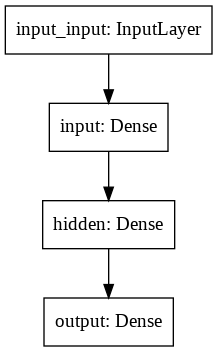
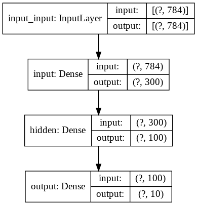

Je l'ai déjà évoqué, on peut aller plus loin que d'utiliser seulement _model.summary()_.  
Car cela peut être **difficile** à lire pour les **gros modèle**.  

On va regarder aujourd'hui comment créer une image qui trace une **carte de ton modèle**:

> tensorflow.keras.utils.plot_model(model_1, "model_1.png")

Voilà comment l'appeler avec ses **valeurs par défaut**. Et voilà le résultat:

On peut faire de même avec le modèle **ResNet152**.  

Attention, l'image fait **503 x 32767 pixels**, ce qui est assez monstrueux!

Il y a un certain nombre de **paramètres** à passer à la fonction :

* _show_shapes_, qui permet de visualiser **le format des couches**
* _show_layer_names_, pour afficher le **nom des couches**
* _rankdir_, pour afficher **verticalement** ou **horizontalement**
* _expand_nested_, pour déplier ou non les **modèles imbriqués**
* _dpi_, pour choisir le **nombre de ppp (points par pouce)**

Voilà ce que cela peut donner:

> tensorflow.keras.utils.plot_model(
>  model_1,  
>  "model_1.png",  
>  show_shapes=True,
>  show_layer_names=True)

# A toi de jouer

N'oublie pas de t'**inscrire par email** pour ne pas rater les prochains épisodes.
