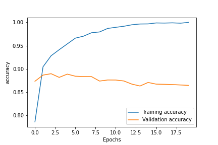

# Qu'est ce que l'_overfitting_ ?

On parle ici d'**apprentissage supervisé**: il y a:
* les **données d'apprentissage**, qui servent à ton réseau à **apprendre**
* les **données de validation**, qui servent à valider ce qu'a appris de ton réseau au fur et à mesure de son apprentissage.
* les **données de test**, qui servent à connaître l'efficacité de ton réseau, une fois l'apprentissage terminé.

Ce qui est important ici, c'est que ton réseau, durant son apprentissage, **ne doit jamais avoir rencontré** les données de test, ni les données de validation.  

Si je prend l'exemple d'une **classification binaire** d'un texte, tu peux apprendre à ton réseau de faire la différence entre un **commentaire positif** et un **commentaire négatif**.

On peut faire cet exercice, par exemple, avec le **dataset imdb** accessible avec _keras_

```
keras.datasets.imdb.load_data(num_words=10000)
```

Je construis le modèle suivant :

```
Model: "sequential_1"
_________________________________________________________________
Layer (type)                 Output Shape              Param #   
=================================================================
dense_3 (Dense)              (None, 16)                160016    
_________________________________________________________________
dense_4 (Dense)              (None, 16)                272       
_________________________________________________________________
dense_5 (Dense)              (None, 1)                 17        
=================================================================
Total params: 160,305
Trainable params: 160,305
Non-trainable params: 0
_________________________________________________________________
```

Je prépare les données d'entrée en construisant des **séquences**, dont je reparlerais une prochaine fois.

Une fois l'entrainement réalisé, je construis les deux courbes suivants, pour le **loss** et l'**accuracy** :




On remarque que :

* avec les données d'apprentissage (en bleu), le réseau **sait différencier de mieux en mieux** les commentaires : l'erreur est de plus en plus faible (_loss_), et la pertinence est de plus en plus grande (_accuracy_).
* avec les données de validation : après quelques _epochs_ seulement, l'**erreur commence à augmenter**. **La pertinence stagne** quasiment de le départ, voire diminue au fur et à mesure de l'apprentissage.

**Que c'est-il passé ?**

Le réseau a appris **un peu trop bien** à différencier les commentaires qu'il a vu pendant l’entraînement.  

Mais il est **incapable de généraliser**.

C'est le principe de l'**overfitting**.

# A toi de jouer

N'oublie pas de t'**[inscrire par email][0]** pour ne pas rater les prochains épisodes.

[0]: {{"page//email.md"|yasifipo}}
