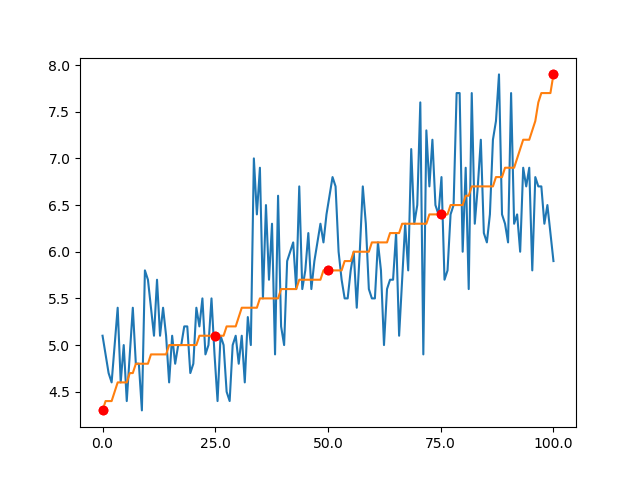

Je l'ai évoqué l'autre jour, sans prendre le temps de le définir : le _percentile_.

Il s'agit d'une valeur qui permet de **séparer les données** en **deux catégories** : celle qui sont **plus grandes**, et celles qui sont **plus petites**, en fonction du nombre de données présentes dans chaque catégorie

Par exemple, le vingtcinquième percentile est la valeur qui est définie telle que 25% des valeurs sont plus petites, et 75 valeurs sont plus grandes.

Le **50ème percentile** est habituellement appelé **la médiane**.

J'ai repris le _dataset Iris_, et j'ai pris en particulier la longueur du sépale.  

J'ai tracé la valeur de chaque point (en bleu).  
J'ai tracé la valeur de chaque point, après avoir trié les données (en orange)
Les points rouges correspondent aux percentiles:
* 0% : il s'agit donc de la valeur minimum
* 25% : un quart des données sont plus petites, trois quarts sont plus grandes
* 50% : c'est la médiane
* 75% : un quart des données sont plus grandes, trois quarts sont plus petites
* 100% : c'est la valeur maximum

# A toi !

Tu veux poursuivre l'aventure ?  
**[Inscrit-toi][0]** pour ne rien rater des prochaines escales !

[0]: {{"page//email.md"|yasifipo}}
